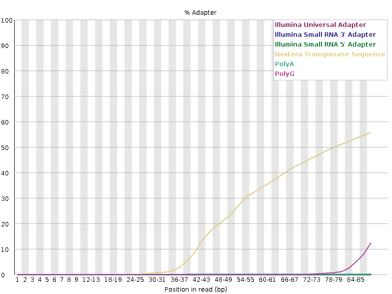
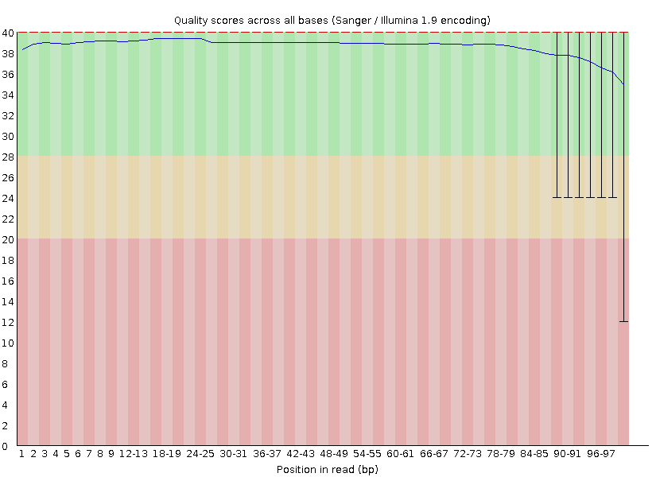
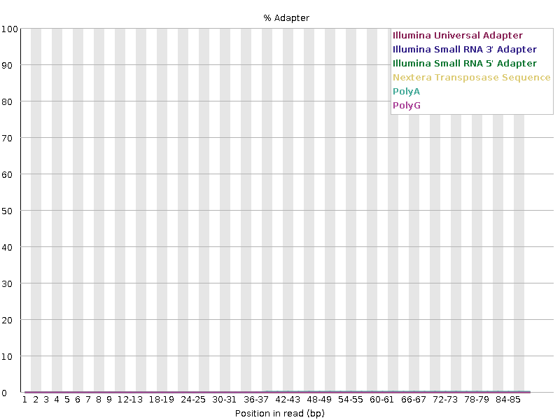
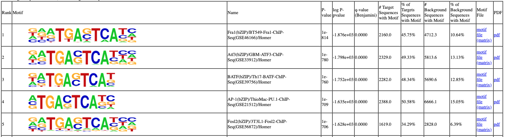
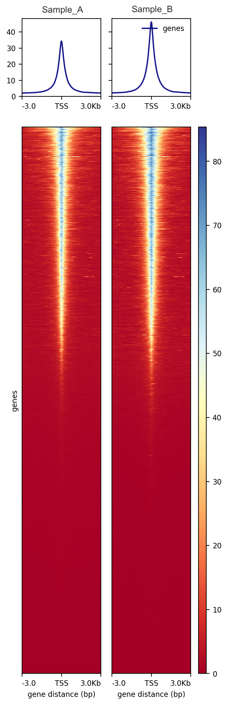

# Pipeline_ATACSeq_nf

A Nextflow (DSL2) port of [Pipeline_ATACSeq](https://github.com/jfreeland01/Pipeline_ATACSeq),
a bulk ATAC-seq analysis pipeline. The original bash scripts remain the reference
implementation and are unaffected by this repo.

One repo, one pipeline. The full preprocessing chain (FastQC → cutadapt → Bowtie2 →
post-alignment filtering → MACS3 → bigWig/Wig) runs by default. Each post-processing
stage from the original scripts (consensus peaks, HOMER motif enrichment, wig
averaging, TSS heatmaps) can also be run on its own with `--stage`, so nothing extra
needs to be cloned or downloaded.

## **Outline**
### Background
- [Contact](#contact)
- [Introduction](#introduction)
### Preprocessing
- [Quality Control on Raw Reads](#quality-control-on-raw-reads)
- [Adapter Trimming](#adapter-trimming)
- [Quality Control on Trimmed Reads](#quality-control-on-trimmed-reads)
- [Alignment](#alignment)
- [Post-Alignment Filtering](#post-alignment-filtering)
- [Peak Calling](#peak-calling)
- [File Conversion Wig/bigWig](#file-conversion-wigbigwig)
### Post-processing
- [Consensus Peaks](#consensus-peaks)
- [Differential Peak Analyses](#differential-peak-analyses)
- [MOTIF Enrichment](#motif-enrichment)
- [Overall TSS Accessibility](#overall-tss-accessibility)
### Running This Pipeline
- [Quick Start](#quick-start-linux-workstation)
- [Requirements](#requirements)
- [Reference Files](#reference-files)
- [Stages](#stages)
- [Usage](#usage)
- [Key Parameters](#key-parameters)
- [A Note on Container Tags](#a-note-on-container-tags)
- [Repo Layout](#repo-layout)

## **Contact**
For questions, comments, suggestions, anything, feel free to contact via git or through the following.

- Email: jackfreeland01@gmail.com
- LinkedIn: [@JackFreeland](https://www.linkedin.com/in/jack-freeland-384526142)
- Twitter: [@JackFreelandLab](https://x.com/JackFreelandLab)

## **Introduction**
This repository is a Nextflow (DSL2) port of a pipeline for processing **bulk ATAC-seq**
data (Assay for Transposase-Accessible Chromatin sequencing). Starting with raw fastq
files, the pipeline calls individual peaks and can generate consensus peak count
matrices, followed by differential peak accessibility, overall TSS accessibility, and
MOTIF enrichment analyses. The sections below walk through each step in detail,
including the rationale and the underlying tool/command, before covering how to
actually run this Nextflow implementation. An excellent resource to first get
familiarized with ATAC-seq analysis can be found in
[Yan et al. (2020)](https://genomebiology.biomedcentral.com/counter/pdf/10.1186/s13059-020-1929-3.pdf).

The [original bash-script pipeline](https://github.com/jfreeland01/Pipeline_ATACSeq)
runs each of these steps as standalone scripts. This repo wraps the same tools,
parameters, and rationale in Nextflow so the full preprocessing chain runs as one
resumable, containerized workflow, while each post-processing stage can still be
run independently via `--stage`.

## **Quality Control on Raw Reads**
Before initiating any formal processing steps, it is advisable to assess the overall quality of the raw sequencing files. This pipeline uses [FastQC](https://www.bioinformatics.babraham.ac.uk/projects/fastqc/) to generate [FastQC reports](https://dnacore.missouri.edu/PDF/FastQC_Manual.pdf) that provide information on sequence quality, GC content, length distribution, duplicate sequences, overrepresented sequences, K-mer content and adapter contamination. For paired-end sequencing, QC is performed separately on both the forward and reverse read files. In ATAC-seq [FastQC reports](https://dnacore.missouri.edu/PDF/FastQC_Manual.pdf), we expect to see Nextera transposase sequencing adapters over-represented and a decrease in overall sequence quality near the 3' end. If interested, alternative or similar software to [FastQC](https://www.bioinformatics.babraham.ac.uk/projects/fastqc/) includes [FastP](https://github.com/OpenGene/fastp) and [BBDuk](https://sourceforge.net/projects/bbmap/).

In this pipeline, raw-read QC is run automatically as part of the `preprocessing`
stage (`modules/local/fastqc/main.nf`), once per sample per read.



**Figure 1: Example FastQC Output of Adapter Content**



**Figure 2: Example FastQC Output of Sequence Quality**

## **Adapter Trimming**
[FastQC](https://www.bioinformatics.babraham.ac.uk/projects/fastqc/) often identifies adapter sequences contaminating the reads, which must be trimmed prior to alignment. These adapter sequences are artificial sequences introduced during library preparation. If not removed, they can falsely align to the reference genome, leading to incorrect mapping results and increased noise. This pipeline uses [CutAdapt](https://cutadapt.readthedocs.io/en/stable/). If interested, alternative or similar software to [CutAdapt](https://cutadapt.readthedocs.io/en/stable/) includes [FastP](https://github.com/OpenGene/fastp), [ApadpterRemoval](https://adapterremoval.readthedocs.io/en/2.3.x/) and [Trimmomatic](http://www.usadellab.org/cms/?page=trimmomatic).

Common adapter sequences are the following:

- Illumina:   AGATCGGAAGAGC
- Small RNA:  TGGAATTCTCGG
- Nextera:    CTGTCTCTTATA

This pipeline defaults to the Nextera adapter (`--adapter_r1` / `--adapter_r2`,
default `CTGTCTCTTATA`) since that's the transposase used in standard ATAC-seq
library prep — override both if your library used a different kit. `cutadapt` runs
with a Phred quality threshold of 20, a minimum adapter-overlap of 6bp, and a
minimum post-trim read length of 35bp (`modules/local/cutadapt/main.nf`).

## **Quality Control on Trimmed Reads**

After running [CutAdapt](https://cutadapt.readthedocs.io/en/stable/), it is good practice to confirm the adapter sequences are no longer present by running [FastQC](https://www.bioinformatics.babraham.ac.uk/projects/fastqc/) again. This pipeline re-runs FastQC on the trimmed reads automatically as part of the `preprocessing` stage.



**Figure 3: Example FastQC Output of Adapter Content Post CutAdapt**

## **Alignment**
After confirming that adapter sequences have been trimmed, the next step is to align the reads to a reference genome. This pipeline uses [Bowtie 2](https://bowtie-bio.sourceforge.net/bowtie2/index.shtml) to align reads to the human genome (GRCh38). [Bowtie 2](https://bowtie-bio.sourceforge.net/bowtie2/index.shtml) references can be found [here](https://benlangmead.github.io/aws-indexes/bowtie). In this example, GRCh38_noalt_decoy_as is used.

The GRCh38 reference genome includes alternate haplotypes, which can cause reads to map equally to multiple regions, potentially resulting in lower quality scores. To address this, it is advantageous to remove alternate haplotypes and retain only the primary assembly ('noalt'). Additionally, including decoy sequences in your analysis can enhance accuracy. If a read aligns to a decoy sequence better than anywhere in the primary reference, it prevents false positives from misalignments within the primary genome. Both steps also decrease processing overhead and runtime. If interested, alternative or similar software to [Bowtie 2](https://bowtie-bio.sourceforge.net/bowtie2/index.shtml) is [BWA](https://bio-bwa.sourceforge.net).

This pipeline runs Bowtie 2 with `--non-deterministic --mm --phred33 --very-sensitive`
(`modules/local/bowtie2/main.nf`) against whatever index you point `--bowtie2_index`
at — see [Reference Files](#reference-files) for the prebuilt GRCh38_noalt_decoy_as
index used in this example.

## **Post-Alignment Filtering**
After aligning the reads, the data is prepared for downstream analyses by converting the file type and applying QC/filtering measures:

- [Convert from SAM to BAM](#convert-from-sam-to-bam)
- [Sort Reads and Index](#sort-reads-and-index)
- [Adjust for Transposase Binding Offset](#adjust-for-transposase-binding-offset)
- [Filter Unaligned Reads](#filter-unaligned-reads)
- [Filter ChrM, DNA Scaffold, and 'Decoy' Reads](#filter-chrm-dna-scaffold-and-decoy-reads)
- [Filter PCR Duplicates](#filter-pcr-duplicates)
- [Filter for Quality Reads](#filter-for-quality-reads)
- [Filter of ENCODE Blacklists](#filter-of-encode-blacklists)

### **Convert from SAM to BAM**
Before applying filtering or QC, the SAM file (a text based format) generated by [Bowtie 2](https://bowtie-bio.sourceforge.net/bowtie2/index.shtml) is converted to a BAM file (a binary format) using [Samtools](https://github.com/samtools/samtools). This conversion significantly reduces storage requirements and processing time, as most tools are optimized to handle BAM files.

### **Sort Reads and Index**
Downstream software requires the BAM file to be sorted and indexed. Sorting organizes the alignments by their genomic coordinates, while indexing creates a companion index file that enables efficient random access to specific regions of the genome within the BAM files. Both steps are performed using [Samtools](https://github.com/samtools/samtools).

### **Adjust for Transposase Binding Offset**
Reads must be adjusted to account for the transposase binding offset to ensure accurate peak summit identification. Tn5 transposase binds to DNA and inserts sequencing adapters at staggered positions. It cuts the DNA with a 9-bp overhang between the strands, meaning the positions reported in sequencing data are not the exact sites of chromatin accessibility but are slightly shifted versions. Without adjustment, peak edges appear shifted, leading to imprecise peak summits. This offset is corrected using [deepTools alignmentSieve](https://deeptools.readthedocs.io/en/develop/content/tools/alignmentSieve.html) (`--ATACshift`).

### **Filter Unaligned Reads**
Reads that failed to align to the reference genome should be removed as they do not provide any information about chromatin accessibility. Removing these reads also decreases file size and computational overhead. [Samtools](https://github.com/samtools/samtools) is used to remove reads with the SAM flag 4, which indicates that the read is unmapped.

### **Filter ChrM, DNA Scaffold, and 'Decoy' Reads**
Mitochondrial reads should be removed as they, like unaligned reads, do not provide any information about chromatin accessibility (chrM). Unplaced and random DNA scaffolds should also be removed, as they are unlikely to reflect the chromatin accessibility of known, structured genomic loci. Decoy reads should be removed as decoy sequences are added to a reference genome to mitigate ambiguous read alignment. Decoy sequences largely do not correspond to functional genomic loci and often represent technical artifacts or poorly characterized regions. [Samtools](https://github.com/samtools/samtools) is used again to exclude any read whose contig name matches `chrM|Un|random|decoy`.

### **Filter PCR Duplicates**
PCR duplicates occur during library preparation. As the limited amount of DNA you start with in ATAC-seq requires PCR amplification to generate sufficient material for sequencing, multiple copies of the same DNA fragment are produced. This leads to identical (duplicated) reads that should be removed. To achieve this, the BAM file is first sorted again with [Samtools](https://github.com/samtools/samtools) and then filtered using [Picard MarkDuplicates](https://gatk.broadinstitute.org/hc/en-us/articles/360037052812-MarkDuplicates-Picard) (`-REMOVE_DUPLICATES true`).

### **Filter for Quality Reads**
Low-quality reads are then filtered out using [Samtools](https://github.com/samtools/samtools) to ensure downstream analyses are based on reliable and biologically meaningful data. The MAPQ threshold defaults to 30 (`--mapq_threshold`, higher = more strict).

### **Filter of ENCODE Blacklists**
Finally, the [ENCODE blacklist](https://www.nature.com/articles/s41598-019-45839-z) contains a list of genomic regions that are critical to remove when analyzing functional genomic data. Reads that map to these regions are typically not due to true biological signal but rather technical artifacts (e.g., misalignment, PCR amplification biases). Keeping these reads can introduce noise and false positives. [Bedtools](https://bedtools.readthedocs.io/en/latest/) `subtract` is used to remove any read that completely overlaps a blacklisted region (`-A`), against the blacklist bundled at `assets/reference/hg38-blacklist.v2.bed`. The final BAM file is also indexed to aid in downstream analyses.

## **Peak Calling**
After filtering the BAM files, peaks can be called. Peaks represent genomic regions with high read enrichment, reflecting areas of open chromatin or accessible DNA. These regions are typically associated with regulatory elements, such as promoters, enhancers, transcription factor binding sites, or other DNA elements where the chromatin is less compact, allowing transcriptional machinery and regulatory proteins to bind. This pipeline uses [MACS3 callpeak](https://github.com/macs3-project/MACS) to identify peaks, with paired-end BAM input (`-f BAMPE`), an FDR threshold of 0.01 (`-q`), and genome size set via `--macs_genome_size` (default `hs` for human; use `mm` for mouse, etc.).

## **File Conversion Wig/bigWig**
Many packages which visualize genomic data (such as ATAC) require BAM files to be converted to either WIG or BigWig files. This pipeline uses [deepTools bamCoverage](https://deeptools.readthedocs.io/en/develop/content/tools/bamCoverage.html) to convert from BAM to BigWig (RPGC-normalized, using `--effective_genome_size`) and [UCSC Genome Browser bigWigToWig](https://www.encodeproject.org/software/bigwigtowig/) to convert from BigWig to Wig. The BigWig→Wig step needs a chrom.sizes file (`--chrom_sizes`); the bundled example at `assets/reference/GRCH38_noalt_decoy_as.chrom.sizes` is structured as follows:

```
chr1    248956422
chr2    242193529
chr3    198295559
...     ...
```

`--chrom_sizes` is optional — omit it to skip the final bigWig→Wig conversion step.

## **Consensus Peaks**
After calling peaks, a peak count matrix can be generated for downstream analyses. As a peak count matrix is a tabular representation of read counts for identified genomic regions (peaks) across multiple samples, it is essential to first generate a set of consensus peaks across all samples. This is because any specific region or peak representing the same biological element across samples may vary by a few bases due to differences in MACS3 peak calling or biology. These variations can significantly complicate downstream quantification, analysis, and interpretation of results.

This pipeline's `consensus_peaks` stage concatenates every sample's `.narrowPeak`
file, sorts and merges the combined intervals with [Bedtools](https://bedtools.readthedocs.io/en/latest/), and then runs `bedtools multicov` across all filtered BAMs against that merged peak set to produce a single counts table.

## **Differential Peak Analyses**
To perform differential peak analyses, workflows very similar to those used for differential gene expression analyses can be applied, including packages such as [DESeq2](https://bioconductor.org/packages/release/bioc/html/DESeq2.html), [edgeR](https://bioconductor.org/packages/release/bioc/html/edgeR.html), and [limma](https://bioconductor.org/packages/release/bioc/html/limma.html).

Of note, the consensus peak count matrix will have the chromosome number, starting base pair position, and ending base pair position in three separate columns. These columns will need to be combined into a single 'name' column before running any of the above packages. For example, by running DESeq2, you will generate a table as follows:

```
                    baseMean    log2FC      lfcSE       stat        pvalue      padj
chr1_808161_808284  30.10598    -0.380062   0.417783    -0.909712   0.362974    0.999999
chr1_817195_817520  84.26785    0.3425648   0.254628    1.3453500   0.178512    0.999999
...                 ...         ...         ...         ...         ...         ...
```

Differential peak analysis is intentionally **not** automated in this pipeline —
it's an analyst-driven statistical step. Its output (a `.txt` per contrast) is
exactly what the `motif_enrichment` stage expects as input.

## **MOTIF Enrichment**
After performing differential peak analysis, motif enrichment analysis allows you to identify transcription factor binding sites or regulatory elements that are enriched within the differentially accessible regions. This provides insights into the potential regulatory mechanisms driving changes in chromatin accessibility and gene expression, helping to connect observed epigenetic changes with underlying biological processes or pathways. By uncovering enriched motifs, you can prioritize key transcription factors or regulatory networks for further functional validation. This pipeline uses [HOMER](http://homer.ucsd.edu/homer/ngs/peakMotifs.html) `findMotifsGenome.pl` to perform the enrichment.



**Figure 4: Example HOMER findMotifsGenome.pl Output**

## **Overall TSS Accessibility**
Aside from analyzing individual peaks, groups of peaks, or motifs, it can also be highly informative to examine the overall accessibility of transcription start sites (TSSs). This approach provides a global view of the openness or closeness of the chromatin across the transcriptome, offering insights into overall regulatory dynamics.

To achieve this, [computeMatrix](https://deeptools.readthedocs.io/en/develop/content/tools/computeMatrix.html) from the DeepTools suite is used to generate a matrix of scores around specific genomic regions, such as TSSs or other features of interest. The matrix contains binned signal values (e.g., read coverage or signal intensity) for defined regions, allowing for detailed analysis of patterns around these sites.

Once the matrix is generated, it is visualized using [plotHeatmap](https://deeptools.readthedocs.io/en/develop/content/tools/plotHeatmap.html). This tool creates an intuitive heatmap that highlights the accessibility patterns of the selected regions, often complemented by an aggregate profile plot. The heatmap helps identify trends in chromatin accessibility, such as regions with consistently high or low accessibility, and can reveal differences between conditions or sample groups.

To group biological replicates or conditions prior to plotting, this pipeline's `wig_mean` stage uses [WiggleTools](https://github.com/Ensembl/WiggleTools) to calculate the average of multiple WIG files before converting the result back to BigWig — feed that averaged BigWig (or any directory of BigWigs) into the `tss_heatmap` stage.



**Figure 5: Example plotHeatmap Output**

## Quick start (Linux workstation)

```bash
# 1. Install Nextflow (requires Java 11+)
curl -s https://get.nextflow.io | bash
sudo mv nextflow /usr/local/bin/

# 2. Clone the pipeline
git clone https://github.com/jfreeland01/Pipeline_ATACSeq_nf.git
cd Pipeline_ATACSeq_nf

# 3. Create your samplesheet using code below or any CSV file (absolute paths)
cat > samplesheet.csv <<'EOF'
sample,fastq_1,fastq_2
SAMPLE1,/path/to/SAMPLE1_R1.fastq.gz,/path/to/SAMPLE1_R2.fastq.gz
EOF

# 4. Run preprocessing
nextflow run . -profile docker \
    --input samplesheet.csv \
    --bowtie2_index /path/to/GRCh38_noalt_decoy_as \
    --blacklist_bed assets/reference/hg38-blacklist.v2.bed \
    --chrom_sizes assets/reference/GRCH38_noalt_decoy_as.chrom.sizes \
    --outdir results \
    -resume
```

## Requirements

- [Nextflow](https://nextflow.io) >= 23.04
- Java 11+ (`sudo apt install default-jdk` on Ubuntu/Debian)
- [Docker](https://www.docker.com) (`-profile docker`) or [Conda](https://docs.conda.io)/Mamba (`-profile conda`)

Every process pins its own Bioconda package + matching Biocontainers image (see
"A note on container tags" below) — there's no single monolithic environment to build.

## Reference files

- **ENCODE blacklist** (`hg38-blacklist.v2.bed`) and **chrom.sizes**
  (`GRCH38_noalt_decoy_as.chrom.sizes`), both GRCh38 no-alt+decoy, are bundled in this
  repo at `assets/reference/` — no download needed, just point `--blacklist_bed` /
  `--chrom_sizes` at them.
- **Bowtie2 index** (GRCh38 no-alt+decoy, ~4 GB) is not bundled — download the
  prebuilt index from
  [Ben Langmead's AWS Bowtie2 indexes](https://benlangmead.github.io/aws-indexes/bowtie)
  (`GRCh38_noalt_decoy_as`, direct link:
  https://genome-idx.s3.amazonaws.com/bt/GRCh38_noalt_decoy_as.zip), unzip it, and
  point `--bowtie2_index` at the extracted path + prefix.

## Stages

| `--stage` value (default: `preprocessing`) | What it does | Original script |
|---|---|---|
| `preprocessing` | FastQC → cutadapt → FastQC → Bowtie2 → ATAC-shift → filter unmapped/chrM/dups/quality/blacklist → MACS3 → bigWig/Wig | `ATACSeq_preprocessing_JF.sh` |
| `consensus_peaks` | Merge all samples' narrowPeak calls into one consensus peak set; count reads per sample across it | `ATACSeq_postprocessing_JF_PeakConcensusCount.sh` |
| `motif_enrichment` | HOMER `findMotifsGenome.pl` on a directory of peak/region files | `ATACSeq_postprocessing_JF_Homer_findMotifsGenome.sh` |
| `wig_mean` | Average a directory of `.wig` files (e.g. replicates), convert to bigWig | `ATACSeq_postprocessing_JF_WigMeanToBW.sh` |
| `tss_heatmap` | computeMatrix (TSS reference-point) + plotHeatmap across a directory of bigWigs | `ATACSeq_postprocessing_JF_ComputeMatrix_heatmap.sh` |

Differential peak analysis (DESeq2/edgeR/limma) is intentionally **not** automated —
it's an analyst-driven statistical step. See [Differential Peak Analyses](#differential-peak-analyses)
above; its output (a `.txt` per contrast) is exactly what `motif_enrichment`
expects as input.

## Usage

### 1. Preprocessing (default)

```bash
nextflow run . -profile docker \
    --input samplesheet.csv \
    --bowtie2_index /path/to/GRCh38_noalt_decoy_as/GRCh38_noalt_decoy_as \
    --blacklist_bed assets/reference/hg38-blacklist.v2.bed \
    --chrom_sizes assets/reference/GRCH38_noalt_decoy_as.chrom.sizes \
    --outdir results
```

`samplesheet.csv` (see `assets/samplesheet_schema.csv`):

```csv
sample,fastq_1,fastq_2
SAMPLE1,/absolute/path/to/SAMPLE1_R1.fastq.gz,/absolute/path/to/SAMPLE1_R2.fastq.gz
SAMPLE2,/absolute/path/to/SAMPLE2_R1.fastq.gz,/absolute/path/to/SAMPLE2_R2.fastq.gz
```

### 2. Consensus peaks

```bash
nextflow run . -profile docker --stage consensus_peaks \
    --peaks_dir results/macs3 \
    --bams_dir results/bam/filtered
```

### 3. Motif enrichment (HOMER)

```bash
nextflow run . -profile docker --stage motif_enrichment \
    --homer_input_dir /path/to/DESeq2/homer \
    --homer_genome hg38
```

### 4. Wig averaging

```bash
nextflow run . -profile docker --stage wig_mean \
    --wig_input_dir results/wig \
    --chrom_sizes /path/to/GRCh38_noalt_decoy_as.chrom.sizes
```

### 5. TSS accessibility heatmap

```bash
nextflow run . -profile docker --stage tss_heatmap \
    --bigwig_dir results/bigwig \
    --tss_bed /path/to/TSS_1_V2.bed
```

See the original repo's README for how to build the `TSS_1_V2.bed` reference file
from the UCSC Table Browser.

## Key parameters

Full list in `nextflow.config`. Most commonly overridden:

| Param | Default | Notes |
|---|---|---|
| `--adapter_r1` / `--adapter_r2` | `CTGTCTCTTATA` (Nextera) | Swap for your library prep kit |
| `--mapq_threshold` | `30` | Post-alignment MAPQ filter |
| `--macs_genome_size` | `hs` | MACS3 `-g`; `mm` for mouse, etc. |
| `--effective_genome_size` | `2913022398` | Human (GRCh38); override for other organisms |
| `--threads` | `4` | Default CPU allocation; tune per-label resources in `conf/base.config` |

## A note on container tags

Container/conda versions were pinned from the original pipeline's
`Conda_Env_Main_ATACSeq_JF.yml` where an exact build was available (bowtie2, cutadapt,
samtools, deepTools, wiggletools, `ucsc-wigtobigwig`). For tools not pinned in that
file (MACS3, Picard, HOMER, bedtools, `ucsc-bigwigtowig`), a recent, commonly-used
Biocontainers tag was chosen — **verify these against
[biocontainers.pro](https://biocontainers.pro) or `conda search -c bioconda <tool>`
before a production run**, and update the `conda`/`container` directives in the
relevant `modules/local/*/main.nf` if you need a different version.

## Repo layout

```
main.nf                      # --stage dispatch to one of the 5 workflows below
nextflow.config               # params, profiles (docker/conda/test), resource labels
conf/base.config              # process resource labels (process_low/medium/high)
conf/test.config              # lightweight resource overrides for smoke testing
modules/local/<tool>/main.nf  # one process per tool (own conda + container directive)
workflows/preprocessing.nf    # PREPROCESSING
workflows/consensus_peaks.nf  # CONSENSUS_PEAKS
workflows/motif_enrichment.nf # MOTIF_ENRICHMENT
workflows/wig_processing.nf   # WIG_MEAN
workflows/tss_heatmap.nf      # TSS_HEATMAP
assets/samplesheet_schema.csv # example samplesheet
assets/reference/              # bundled ENCODE blacklist + chrom.sizes
assets/figures/                 # example output images used in this README
```
